# Car Rental Management System

A desktop-based, Java-powered Car Rental System that allows customers to browse, reserve, and return vehicles, while providing an admin panel for managing cars, users, and reservations. Designed with a clean UI using JavaFX and SceneBuilder, the system ensures seamless booking and return flow without the need for an external database.
## Features

### User Registration & Login
Secure authentication for customers and admins.

### Vehicle Browsing & Booking
Customers can view available cars, check details, and make reservations.

### Car Return System
Allows users to return rented vehicles, updating the availability status.

### Reservation Management
Track current and upcoming reservations. Prevents double-booking.

### Admin Panel

### Car Management: 
Add, remove, and edit vehicle details.

### Reservation Management: 
View and manage all bookings.

### User Management: 
View all registered users.

### Role-Based Access
Clean separation of features between admin and regular users.

### File-Based Data Storage
Stores user, car, and booking data in local text files using custom Java logic — no database required.

## Tech Stack

### Frontend & UI: 
JavaFX, SceneBuilder

### Backend: 
Java (OOP, Exception Handling, File I/O)

### Storage: 
Pure Java File Handling (TXT files)

## Screenshots
### Main Panel

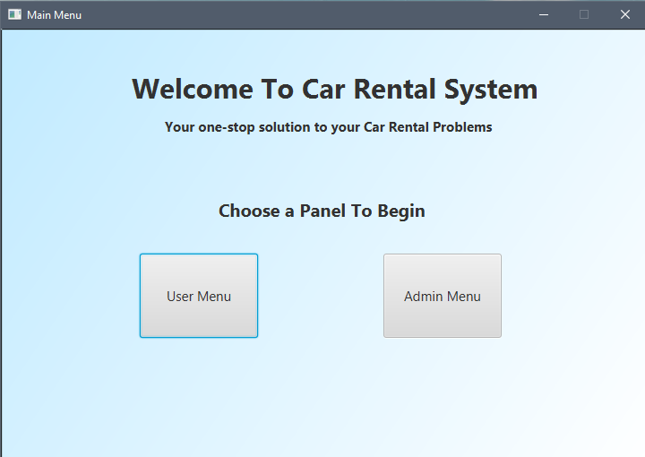

### Admin Login

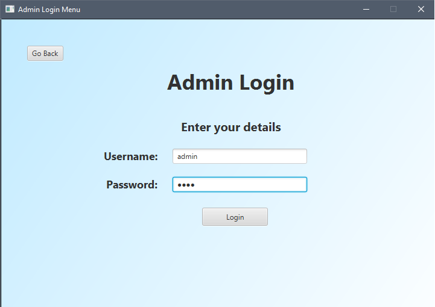

### Admin Dashboard

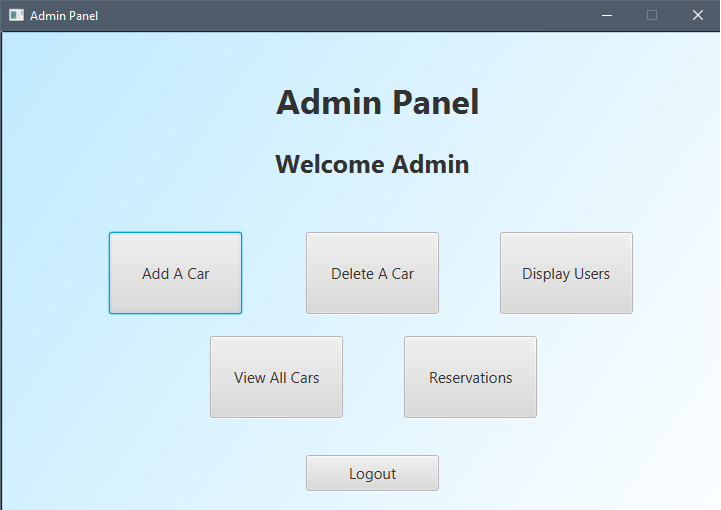

### Manage Cars

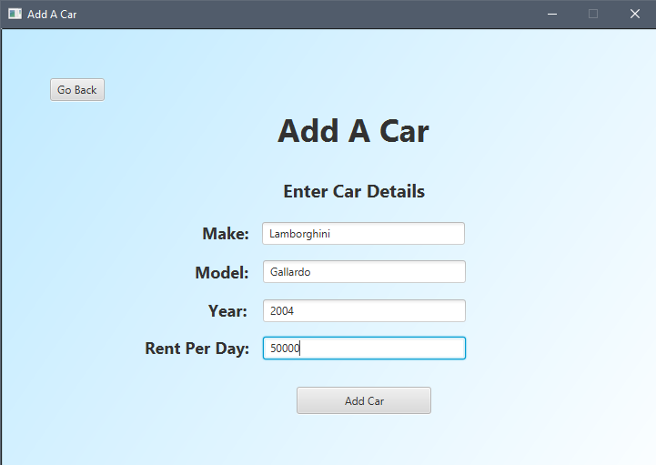
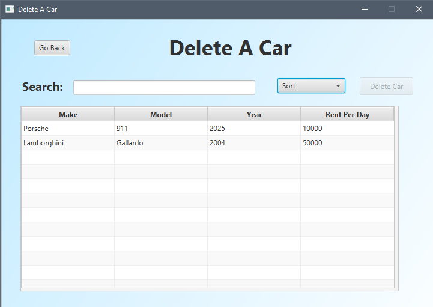

### Manage Users

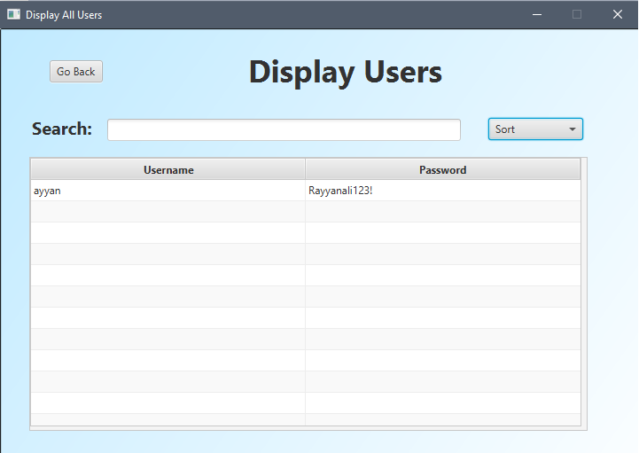

### View Reservations

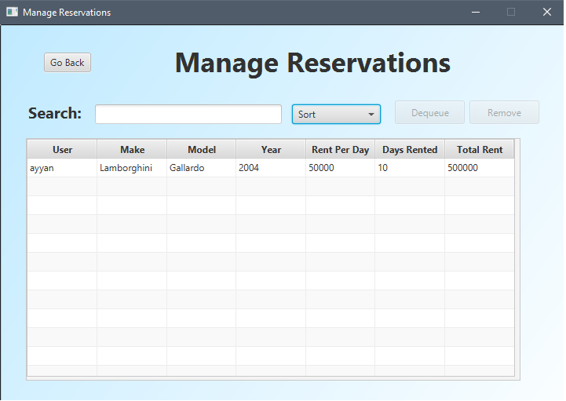

### User Register

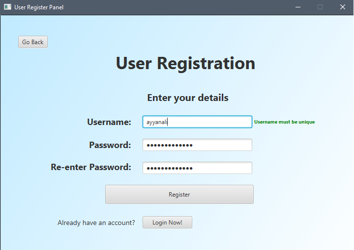

### User Login

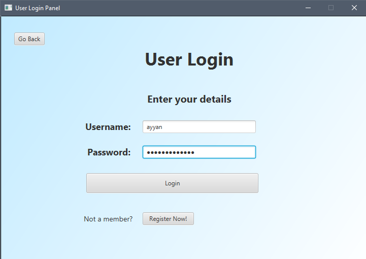

### User Dashboard

### Rent Car

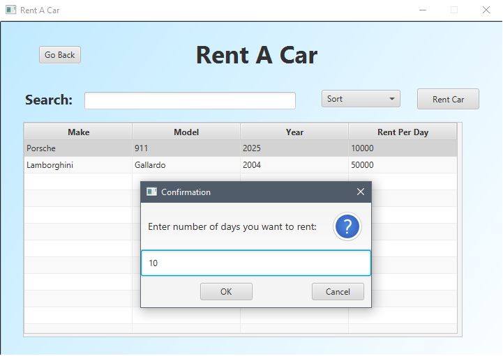

### Return Car

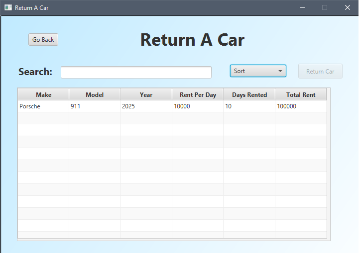

### Make Reservation

## Use Case

Perfect for educational purposes or small-scale rental businesses looking to digitize their vehicle booking process without setting up a database. Demonstrates solid Java fundamentals, including OOP, file handling, and GUI design.
